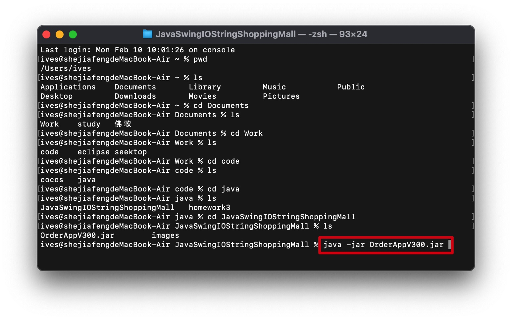
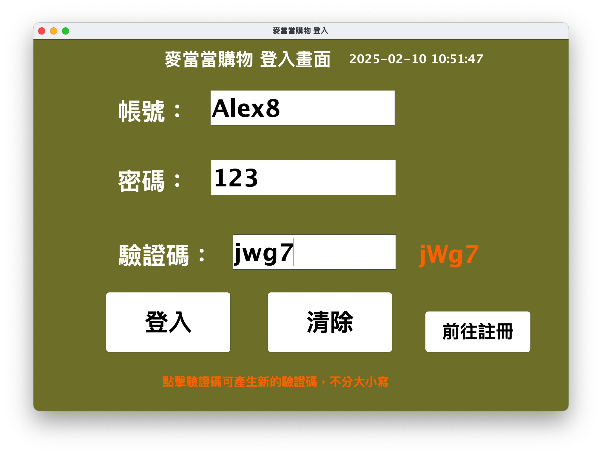
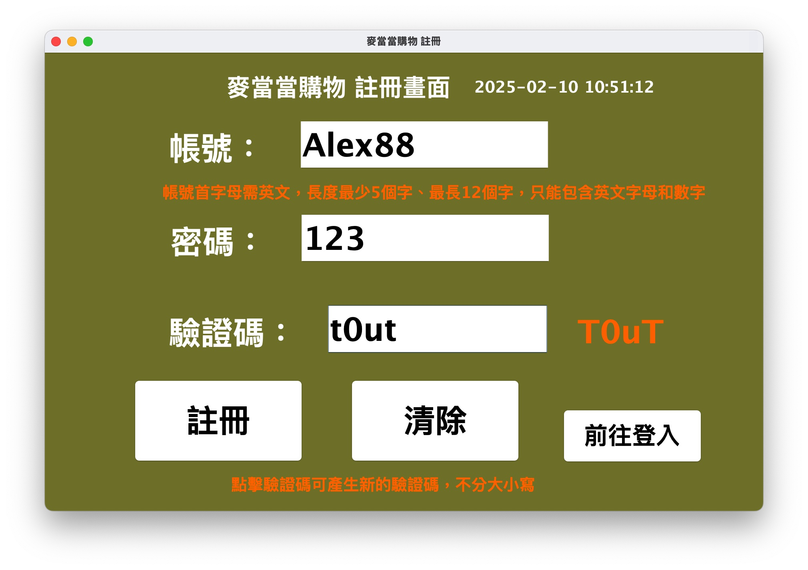
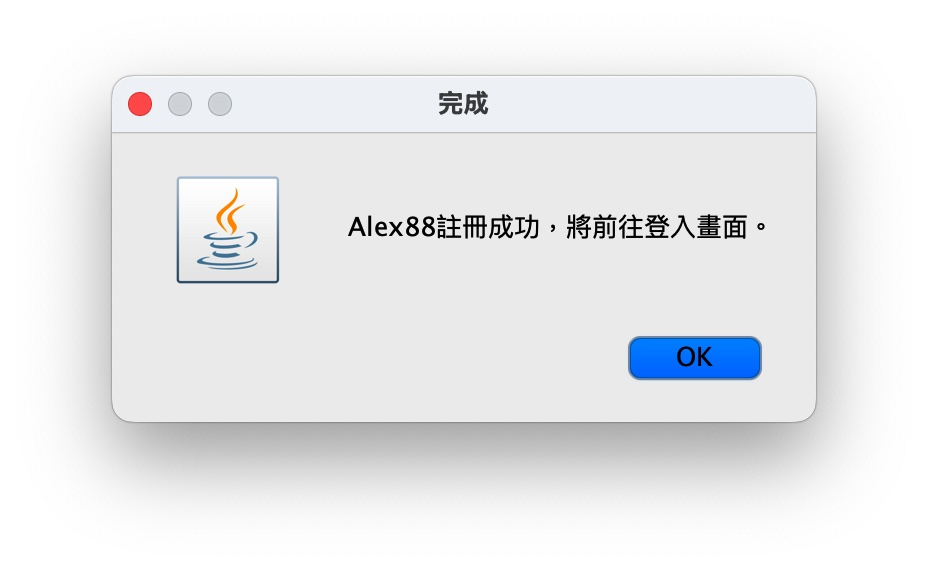
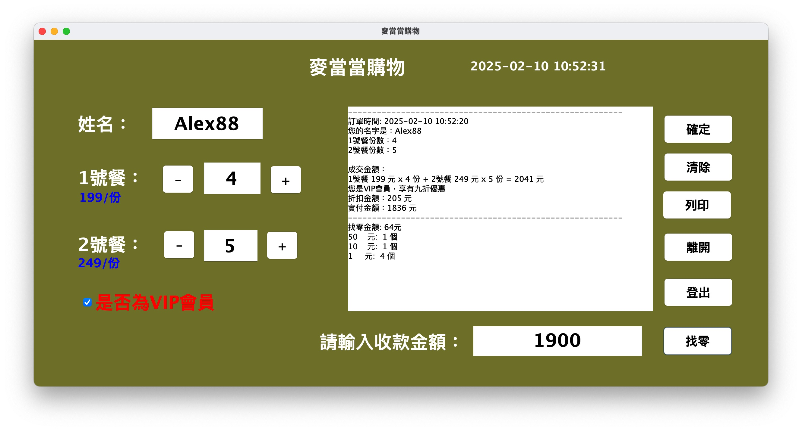

# Java Swing 搭配IO Stream 建立簡易商城系統

## 使用技術
- java jdk11
- Swing
- eclipse windowbuilder
- dao pattern

# 使用方式

## 前置條件

- 安裝jdk11
[jdk-11.0.25_windows-x64_bin](https://github.com/IvesShe/JavaSwingIOStringShoppingMall/blob/main/OrderAppV300.jar)

## 下載本專案對應檔案

下載OrderAppV300.jar


windows環境直接雙擊OrderAppV300.jar，即可執行

mac環境要開啟終端機，輸入

```shell
java -jar OrderAppV300.jar
```


# 登入畫面



# 註冊畫面






# 新增訂單畫面



# 其它專案

[Java Swing jdbc搭配MySQL 建立簡易商城系統](https://github.com/IvesShe/JavaSwingMySQLShoppingMall)

# Model

<h3>原始碼在src資料夾，僅供參考</h3>

## Order

```java
package model;

import java.time.LocalDateTime;
import java.time.format.DateTimeFormatter;

public class Order {
	private String name;
	private Integer mealNo1;
	private Integer mealNo2;
	private Integer sum;
	// 1號餐售價
	static Integer mealNo1Price = 199;
	// 2號餐售價
	static Integer mealNo2Price = 249;
	
	public Order(String name, Integer mealNo1Price, Integer mealNo2) {
		super();
		this.name = name;
		this.mealNo1 = mealNo1Price;
		this.mealNo2 = mealNo2;
	}

	public String getName() {
		return name;
	}

	public void setName(String name) {
		this.name = name;
	}	

	public Integer getMealNo1() {
		return mealNo1;
	}

	public void setMealNo1(Integer mealNo1) {
		this.mealNo1 = mealNo1;
	}

	public Integer getMealNo2() {
		return mealNo2;
	}

	public void setMealNo2(Integer mealNo2) {
		this.mealNo2 = mealNo2;
	}

	public static Integer getMealNo1Price() {
		return mealNo1Price;
	}

	public static void setMealNo1Price(Integer mealNo1Price) {
		Order.mealNo1Price = mealNo1Price;
	}

	public static Integer getMealNo2Price() {
		return mealNo2Price;
	}

	public static void setMealNo2Price(Integer mealNo2Price) {
		Order.mealNo2Price = mealNo2Price;
	}

	public Integer getSum() {
		this.sum = this.mealNo1 * Order.mealNo1Price + this.mealNo2 * Order.mealNo2Price;
		return sum;
	}
	
	public String showOrder(Boolean vipMember) {
		// 取得當前的系統時間
	    LocalDateTime now = LocalDateTime.now();
	    DateTimeFormatter formatter = DateTimeFormatter.ofPattern("yyyy-MM-dd HH:mm:ss");
	    String currentTime = now.format(formatter);
	    
	    String outputMessage = String.format(
	            "---------------------------------------------------------\n" +
	            "訂單時間: %s\n" +  
	            "您的名字是：%s\n" +
	            "1號餐份數：%d\n" +
	            "2號餐份數：%d\n\n" +
	            "成交金額：\n" +
	            "1號餐 %d 元 x %d 份 + 2號餐 %d 元 x %d 份 = %d 元",
	            currentTime,  // 顯示當前時間
	            this.getName(),
	            this.getMealNo1(),
	            this.getMealNo2(),
	            Order.getMealNo1Price(),
	            this.getMealNo1(),
	            Order.getMealNo2Price(),
	            this.getMealNo2(),
	            this.getSum()
	    );

	    if (vipMember) {
	        outputMessage += String.format(
	                "\n您是VIP會員，享有九折優惠\n" +
	                "折扣金額：%d 元\n" +
	                "實付金額：%d 元",
	                (this.getSum() - (int)(this.getSum() * 0.9)),
	                (int)(this.getSum() * 0.9)
	        );
	    } else {
	        outputMessage += "\n您是一般會員，無任何優惠";
	    }

	    outputMessage += "\n---------------------------------------------------------";
	    return outputMessage;
	}
	
}


```


